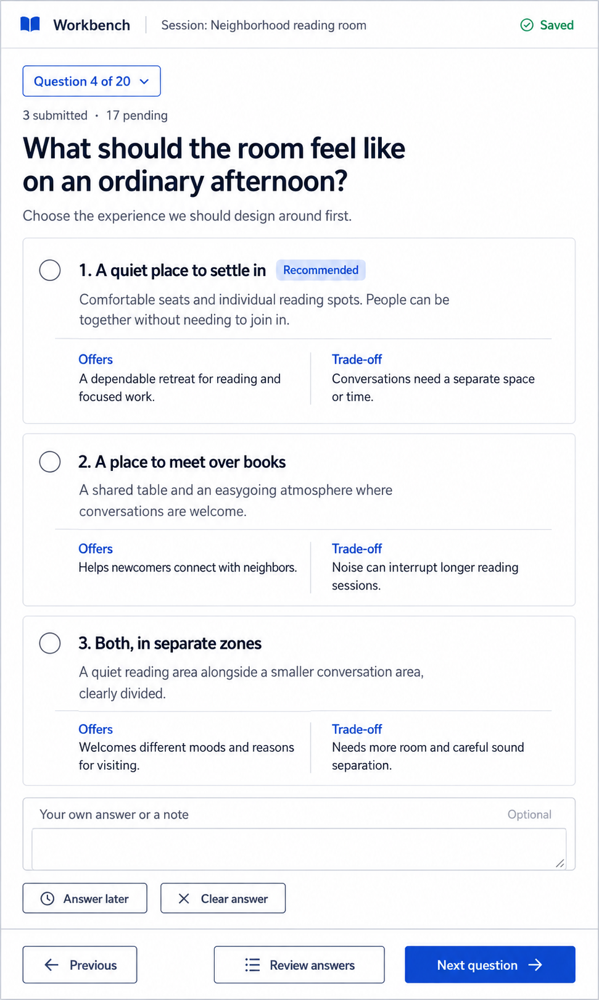
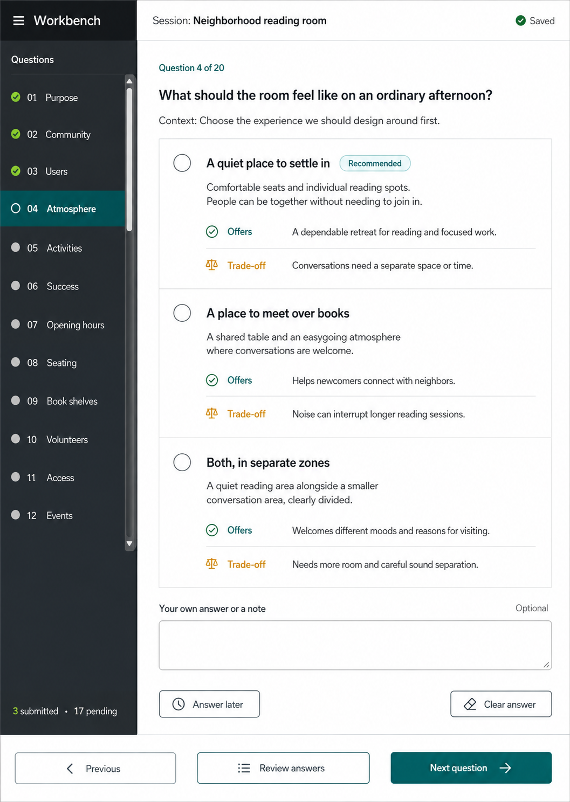
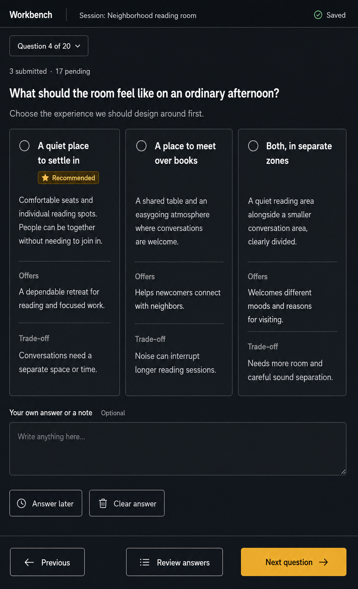

# UI directions

Generated September 5, 2026 with the built-in image generation tool in response to the user's request to compare UI concepts before implementing a chosen direction.

Status: the user explicitly selected **B — Visible navigator** on September 5, 2026. The prototype implements its dark scrollable sidebar, compact form, teal primary action, and persistent footer. Narrow panes use a question picker. The original images remain design references; subsequent user decisions require whole-form submission and automatic socket handoff, superseding the partial-submission details shown in these mockups.

All three concepts depict the same sample question in a 20-question session. Image typography and proportions are illustrative; the chosen design must be implemented responsively and checked at the actual embedded-browser size while preserving the agreed answer-state behavior.

## A — Focused form



<details>
<summary>Final generation prompt</summary>

```text
Use case: ui-mockup. Generate one extremely polished, realistic, implementable web-application UI design screenshot, for a local question-answering workbench inside an embedded browser. Portrait screen, approximate viewport 808 by 1139 CSS pixels, rendered at high resolution with crisp legible text. It is the product itself, not a marketing landing page or a device mockup. Fill the entire canvas with the UI; no phone/laptop, exterior frame, poster layout, perspective, decorative illustrations, charts, photography or gradients. Space-efficient professional interaction design, readable 16px-equivalent body text, distinct tangible buttons and generous but disciplined spacing. The working surface is foremost. Only one current question, full option descriptions and trade-offs visible, no massive title area, no horizontal question tabs, no clarification/comment controls or chatbot. Supports 20 questions via the specified navigator. Sample state: question 4 of 20, 3 submitted, 17 pending, current answer unanswered; all radio circles EMPTY. Recommended is a small label, NOT a selection. Exact shared content to typeset:
App: 'Workbench'. Session: 'Neighborhood reading room'. Save indicator: 'Saved'. Position: 'Question 4 of 20'. Current question: 'What should the room feel like on an ordinary afternoon?' Context: 'Choose the experience we should design around first.'
Three answer options:
1. 'A quiet place to settle in', badge 'Recommended'. Description: 'Comfortable seats and individual reading spots. People can be together without needing to join in.' Benefit label 'Offers', text 'A dependable retreat for reading and focused work.' Trade-off label 'Trade-off', text 'Conversations need a separate space or time.'
2. 'A place to meet over books'. Description: 'A shared table and an easygoing atmosphere where conversations are welcome.' Offers: 'Helps newcomers connect with neighbors.' Trade-off: 'Noise can interrupt longer reading sessions.'
3. 'Both, in separate zones'. Description: 'A quiet reading area alongside a smaller conversation area, clearly divided.' Offers: 'Welcomes different moods and reasons for visiting.' Trade-off: 'Needs more room and careful sound separation.'
An empty note field labelled 'Your own answer or a note' with 'Optional', visible modest height. Secondary actions 'Answer later' and 'Clear answer' are real bordered buttons with separation. At the screen bottom a permanently visible fixed action bar: Previous control, secondary outlined 'Review answers', and strong primary 'Next question →'. Do not replace Next with Submit. Show '3 submitted · 17 pending' in a small useful status line. Do not add extra capabilities. Keep every content block and footer fully within the image with no cropped controls. Render legible realistic typography. This is a design option, not a screenshot of existing software.
Direction A: FOCUSED FORM. A restrained, premium light interface reminiscent of the best modern writing and productivity applications, but with its own identity. White surface, cool neutral gray backdrop only where useful, crisp dark navy text, saturated royal-blue primary control. Compact 52px-equivalent top app bar, with session title as small secondary context. NO SIDEBAR. At top of content a small strongly recognizable outlined dropdown button 'Question 4 of 20 ▾' and the saved status. Current question immediately follows. Three full-width answer cards stacked vertically, with clearly outlined empty radio affordances, visible subtle borders, compact two-column Offers/Trade-off within each card. Main form is not nested in yet another giant card. Option cards do not waste vertical space; all three and note/actions fit this portrait viewport. Bottom bar is well separated and Next is unambiguously primary. Feel calm, precise, finished, and easy to read. The key visual distinction is excellent single-column hierarchy and clarity.
```

</details>

## B — Visible navigator



<details>
<summary>Final generation prompt</summary>

```text
Use case: ui-mockup. Generate one extremely polished, realistic, implementable web-application UI design screenshot, for a local question-answering workbench inside an embedded browser. Portrait screen, approximate viewport 808 by 1139 CSS pixels, rendered at high resolution with crisp legible text. It is the product itself, not a marketing landing page or a device mockup. Fill the entire canvas with the UI; no phone/laptop, exterior frame, poster layout, perspective, decorative illustrations, charts, photography or gradients. Space-efficient professional interaction design, readable 16px-equivalent body text, distinct tangible buttons and generous but disciplined spacing. The working surface is foremost. Only one current question, full option descriptions and trade-offs visible, no massive title area, no horizontal question tabs, no clarification/comment controls or chatbot. Supports 20 questions via the specified navigator. Sample state: question 4 of 20, 3 submitted, 17 pending, current answer unanswered; all radio circles EMPTY. Recommended is a small label, NOT a selection. Exact shared content to typeset:
App: 'Workbench'. Session: 'Neighborhood reading room'. Save indicator: 'Saved'. Position: 'Question 4 of 20'. Current question: 'What should the room feel like on an ordinary afternoon?' Context: 'Choose the experience we should design around first.'
Three answer options:
1. 'A quiet place to settle in', badge 'Recommended'. Description: 'Comfortable seats and individual reading spots. People can be together without needing to join in.' Benefit label 'Offers', text 'A dependable retreat for reading and focused work.' Trade-off label 'Trade-off', text 'Conversations need a separate space or time.'
2. 'A place to meet over books'. Description: 'A shared table and an easygoing atmosphere where conversations are welcome.' Offers: 'Helps newcomers connect with neighbors.' Trade-off: 'Noise can interrupt longer reading sessions.'
3. 'Both, in separate zones'. Description: 'A quiet reading area alongside a smaller conversation area, clearly divided.' Offers: 'Welcomes different moods and reasons for visiting.' Trade-off: 'Needs more room and careful sound separation.'
An empty note field labelled 'Your own answer or a note' with 'Optional', visible modest height. Secondary actions 'Answer later' and 'Clear answer' are real bordered buttons with separation. At the screen bottom a permanently visible fixed action bar: Previous control, secondary outlined 'Review answers', and strong primary 'Next question →'. Do not replace Next with Submit. Show '3 submitted · 17 pending' in a small useful status line. Do not add extra capabilities. Keep every content block and footer fully within the image with no cropped controls. Render legible realistic typography. This is a design option, not a screenshot of existing software.
Direction B: VISIBLE NAVIGATOR. A sophisticated two-pane working application with a very compact persistent graphite sidebar about 156 CSS pixels wide, the remaining width a bright white question-and-answer canvas. Deep teal accent for active navigation and main Next button. A compact header, no oversized session introduction. In the sidebar show 'Questions' and a vertically scrollable list of 20 questions, represented by numbers, short understandable names, and small status dots. Show approximately 12 rows with a visible scrollbar indicating the rest. Rows 01–03 have check marks; row 04 'Atmosphere' is active; following names can be 'Activities', 'Success', 'Opening hours', 'Seating', 'Book shelves', 'Volunteers', 'Access', 'Events'. Never a horizontal strip of full question titles. Use the main area efficiently, with three stacked selectable answer panels whose descriptions and trade-offs are fully visible. More compact row-based treatment than pillowy nested cards; precise separators, distinct radio circles, strong typography. Notes below options. Shared fixed bottom action bar spans the work surface with Next primary. The key distinction is always seeing where you are in a long questionnaire without taking over the page.
```

</details>

## C — Compare options



<details>
<summary>Final generation prompt</summary>

```text
Use case: ui-mockup. Generate one extremely polished, realistic, implementable web-application UI design screenshot, for a local question-answering workbench inside an embedded browser. Portrait screen, approximate viewport 808 by 1139 CSS pixels, rendered at high resolution with crisp legible text. It is the product itself, not a marketing landing page or a device mockup. Fill the entire canvas with the UI; no phone/laptop, exterior frame, poster layout, perspective, decorative illustrations, charts, photography or gradients. Space-efficient professional interaction design, readable 16px-equivalent body text, distinct tangible buttons and generous but disciplined spacing. The working surface is foremost. Only one current question, full option descriptions and trade-offs visible, no massive title area, no horizontal question tabs, no clarification/comment controls or chatbot. Supports 20 questions via the specified navigator. Sample state: question 4 of 20, 3 submitted, 17 pending, current answer unanswered; all radio circles EMPTY. Recommended is a small label, NOT a selection. Exact shared content to typeset:
App: 'Workbench'. Session: 'Neighborhood reading room'. Save indicator: 'Saved'. Position: 'Question 4 of 20'. Current question: 'What should the room feel like on an ordinary afternoon?' Context: 'Choose the experience we should design around first.'
Three answer options:
1. 'A quiet place to settle in', badge 'Recommended'. Description: 'Comfortable seats and individual reading spots. People can be together without needing to join in.' Benefit label 'Offers', text 'A dependable retreat for reading and focused work.' Trade-off label 'Trade-off', text 'Conversations need a separate space or time.'
2. 'A place to meet over books'. Description: 'A shared table and an easygoing atmosphere where conversations are welcome.' Offers: 'Helps newcomers connect with neighbors.' Trade-off: 'Noise can interrupt longer reading sessions.'
3. 'Both, in separate zones'. Description: 'A quiet reading area alongside a smaller conversation area, clearly divided.' Offers: 'Welcomes different moods and reasons for visiting.' Trade-off: 'Needs more room and careful sound separation.'
An empty note field labelled 'Your own answer or a note' with 'Optional', visible modest height. Secondary actions 'Answer later' and 'Clear answer' are real bordered buttons with separation. At the screen bottom a permanently visible fixed action bar: Previous control, secondary outlined 'Review answers', and strong primary 'Next question →'. Do not replace Next with Submit. Show '3 submitted · 17 pending' in a small useful status line. Do not add extra capabilities. Keep every content block and footer fully within the image with no cropped controls. Render legible realistic typography. This is a design option, not a screenshot of existing software.
Direction C: COMPARE OPTIONS. A beautiful high-contrast dark professional interface: near-black graphite canvas, layered charcoal surfaces, soft near-white main text, clearly readable muted text, restrained amber-gold accent on the primary Next button and recommendation badge. No sidebar. Compact top app bar and clearly bordered question-picker 'Question 4 of 20 ▾'. Current question prominent but concise near the top. Display the THREE options SIDE BY SIDE as equal-width comparison columns within the 808px-equivalent viewport. Each column is a real bordered selectable card with an EMPTY radio, title, full description, Offers section and Trade-off section. Align sections horizontally between the columns so trade-offs can be compared at a glance. The cards use most of the available height and their text wraps naturally at readable size; avoid tiny type. Below the three cards, a full-width note field and clearly outlined Answer later / Clear answer buttons. Footer permanently visible with Previous, secondary outlined Review answers, and a bright amber Next question button. Compact status line 3 submitted /17 pending. The key distinction is being able to compare the three choices at once instead of scanning vertically. No glows, frosted glass or decorative effects.
```

</details>

